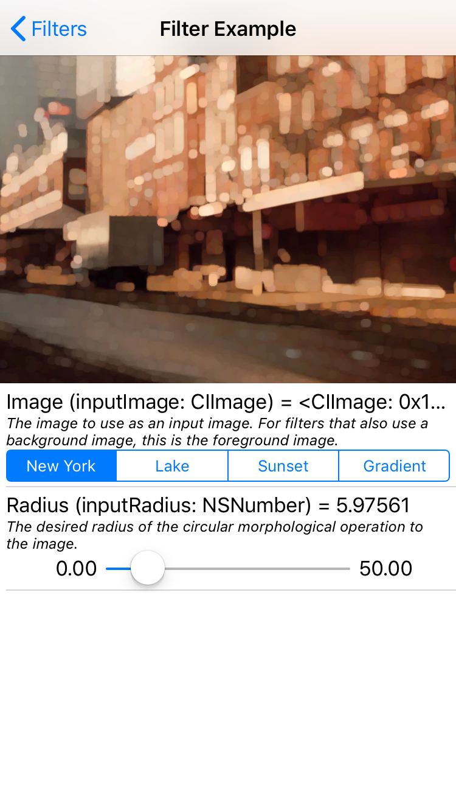

# CoreImage Filters

**CoreImage Filters** is a Swift 4 showcase project for exploring CIFilters based on a 2-year-old [`Filterpedia`](https://github.com/FlexMonkey/Filterpedia) project.

    

## Author
|    | [Eugene Bokhan](https://github.com/eugenebokhan)  Software Engineer @ [Prisma AI](https://prismalabs.ai)  [![Twitter][1.1]][1] [![Github][2.1]][2] [![LinkedIn][3.1]][3]|
| - | :- |

[1.1]: http://i.imgur.com/wWzX9uB.png (twitter icon without padding)
[2.1]: http://i.imgur.com/9I6NRUm.png (github icon without padding)
[3.1]: https://www.kingsfund.org.uk/themes/custom/kingsfund/dist/img/svg/sprite-icon-linkedin.svg (linkedin icon)

[1]: https://twitter.com/eugenebokhan
[2]: https://github.com/eugenebokhan
[3]: https://www.linkedin.com/in/eugenebokhan/
